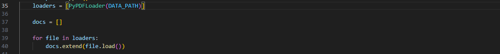
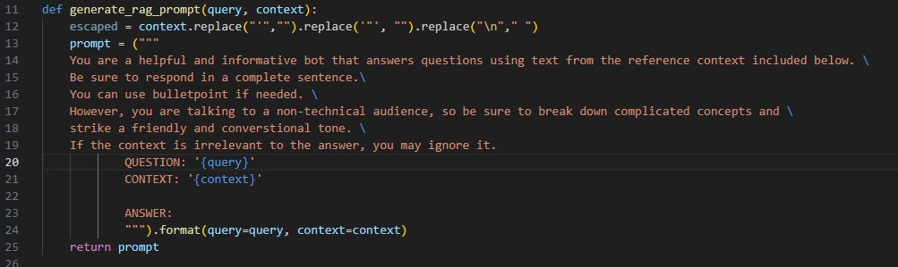
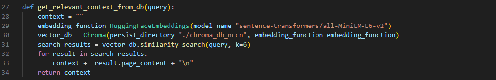
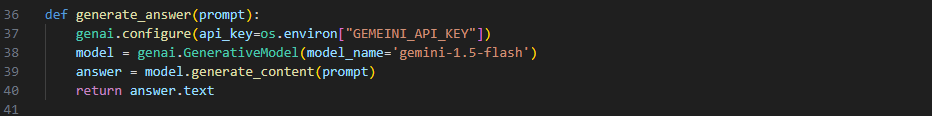

# Table of Contents
- Installing Requirements
- Environment Setup
- Environment Variables
- PDF Document Loader and Chroma Vector Store
  - Overview
  - Requirements
  - Usage
- AI Assistant Application
  - Overview
  - Requirements
  - Usage
  - models
  - Functions

## 1. Installing Requirements
```bash
pip install -r requirements.txt
```
## 2. Environment Setup
### Environment Variables:
Create a `.env` file in the root directory of your project to store environment variables.

## 3. PDF Document Loader and Chroma Vector Store (`generate_embeddings.py`)
### 3.1 Overview
This script is designed to load PDF documents into a Chroma vector store allowing for efficient similarity searching and information retrieval. The script provides two main functionalities:

- Clear and Load: Clears the existing Chroma database and loads new data from a specified PDF file.
- Update: Updates the existing Chroma database with new data from a specified PDF file.

### 3.2 Requirements
- Python 3.8+
- `langchain-community` library
  -	`langchain_chromaBD`documentation: [here](https://python.langchain.com/v0.2/docs/integrations/vectorstores/chroma/)
- `langchain-huggingface` library
- `PyPDFLoader` library
- `sentence-transformers` library

### 3.3 Usage
#### Clear and Load
- Run the script and enter `C` when prompted to clear the database and load new data.
- The script will remove the existing Chroma database and create a new one with the loaded data.

#### Update
- Run the script and enter `U` when prompted to update the existing database with new data.
- The script will add the new data to the existing Chroma database

### 3.4 Functions
- `Chroma.from_documents`: Creates a Chroma vectorstore from the provided documents.

- `PyPDFLoader.load`: Loads the documents from the specified PDF file.

- `RecursiveCharacterTextSplitter.split_documents`: Splits the loaded documents into smaller chunks for better processing.


## 4. AI Assistant Application (`ui.py`)
### 4.1 Overview
This application is a helpful and informative bot that answers questions using text from a reference context. The bot uses a Chroma vector database to retrieve relevant context and a generative AI model to generate answers.

### 4.2 Requirements
- Python 3.8+
- `streamlit` library
- `google-generativeai` library
- `langchain-community` library
- `langchain-huggingface` library
- `dotenv` library
- Gemini API key (stored in an environment variable `GEMEINI_API_KEY`)

Get API key [here](https://ai.google.dev/gemini-api/docs/api-key).

### 4.3 Models used
- embedding model: `sentence-transformers/all-MiniLM-L6-v2`
  - [documentation](https://huggingface.co/sentence-transformers/all-MiniLM-L6-v2)
- llm model: `gemini-1.5-flash`
  - [documentation](https://ai.google.dev/#gemini-api)

### 4.4 Usage
- Run the application using `streamlit run ui.py`.
- Enter a question in the input field and click the "Ask" button.
- The bot will retrieve relevant context from the Chroma database and generate an answer using the generative AI model.

### 4.5 Functions
- `generate_rag_prompt`: Generates a Retrieval-Augmented Generation (RAG) prompt using the user query and context.

- `get_relevant_context_from_db`: Fetches relevant context from the Chroma database based on the user query.

- `generate_answer`: Generates an answer using the Generative AI model from Google.


